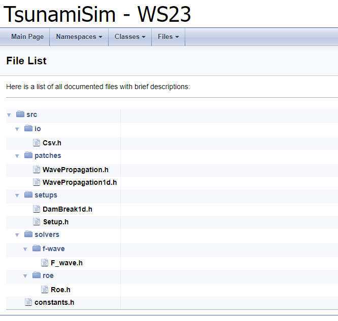

1 Riemann Solver
========================================

Links:
------------

`Github Repo <https://github.com/MherMnatsakanyan03/tsunami_lab.git>`_

Individual Contributions:
-------------------------

Mher Mnatsakanyan and Maurice Herold did a similar amount of work.

Task 1.2:
-------------------------

Github-Clone: See `Github Repo <https://github.com/MherMnatsakanyan03/tsunami_lab.git>`_

Doxygen Documentaion via :code:`doxygen Doxyfile`

Unit-tests for the first Week are done and went smooth.
The following is a video representing the Dambreak and the Height/Momentum over time

.. video:: _static/content/videos/1d-wave-visual.mp4
   :width: 700
   :loop:
   :autoplay:
   :muted:

Task 1.3:
-------------------------
The Riemann-Solver and the Roe Solver have similar results in tests for Dambreak.
However, there are some differences between them:

* a jump-in-fluxes is used as input in the Riemann-Solver (was jump-in-quantities)
* The net updates in the Riemann-Solver are not multiplied by l_sL / l_sR

.. code-block:: c++

    void tsunami_lab::solvers::FWave::flux(t_real i_h,
                                       t_real i_hu,
                                       t_real *o_flux)
    {
        o_flux[0] = i_hu;
        o_flux[1] = i_hu * i_hu / i_h + m_g * (0.5f * i_h * i_h);
    }

* The wave-updates are being added together

.. code-block:: c++
    
    // compute waves
    t_real l_waveL[2] = {0};
    t_real l_waveR[2] = {0};

    l_waveL[0] = l_aL;
    l_waveL[1] = l_aL * l_sL;

    l_waveR[0] = l_aR;
    l_waveR[1] = l_aR * l_sR;

    // set net-updates depending on wave speeds
    for (unsigned short l_qt = 0; l_qt < 2; l_qt++)
    {
        // init
        o_netUpdateL[l_qt] = 0;
        o_netUpdateR[l_qt] = 0;

        // 1st wave
        if (l_sL < 0)
        {
            o_netUpdateL[l_qt] += l_waveL[l_qt];
        }
        else
        {
            o_netUpdateR[l_qt] += l_waveL[l_qt];
        }

        // 2nd wave
        if (l_sR > 0)
        {
            o_netUpdateR[l_qt] += l_waveR[l_qt];
        }
        else
        {
            o_netUpdateL[l_qt] += l_waveR[l_qt];
        }
    }