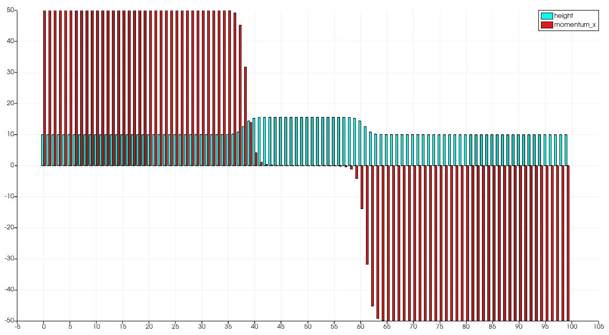
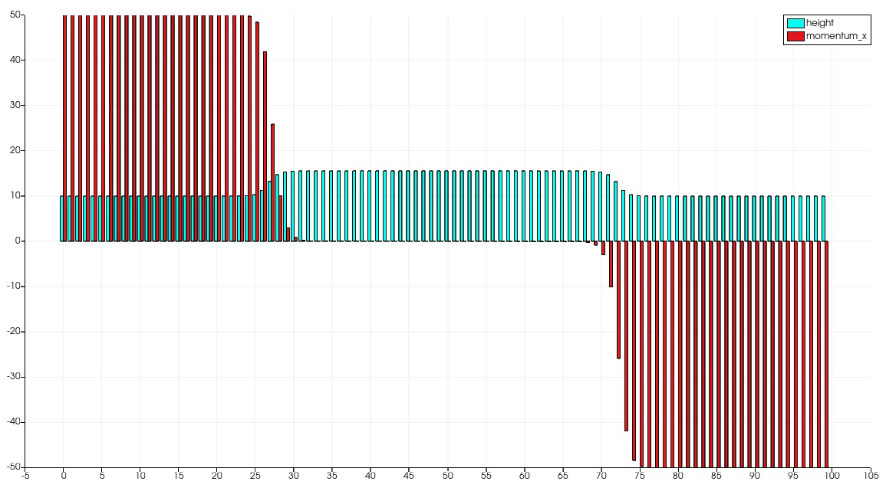
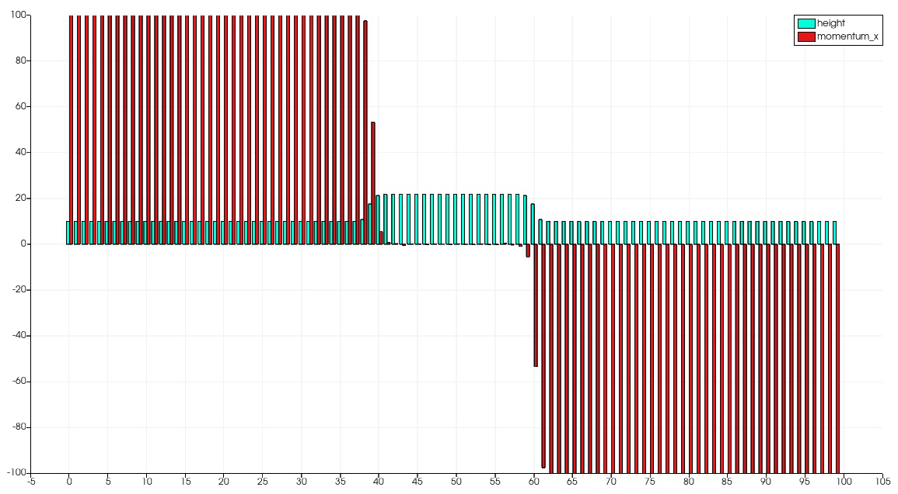
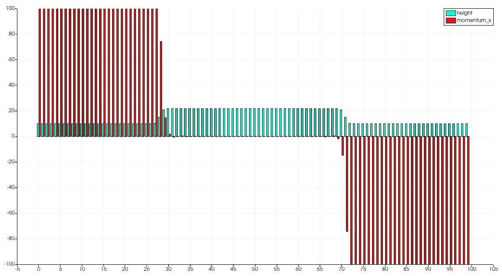
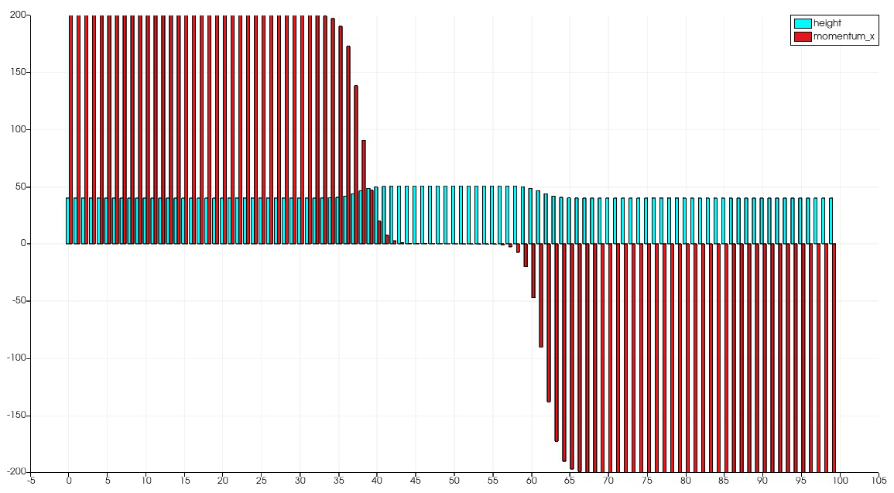
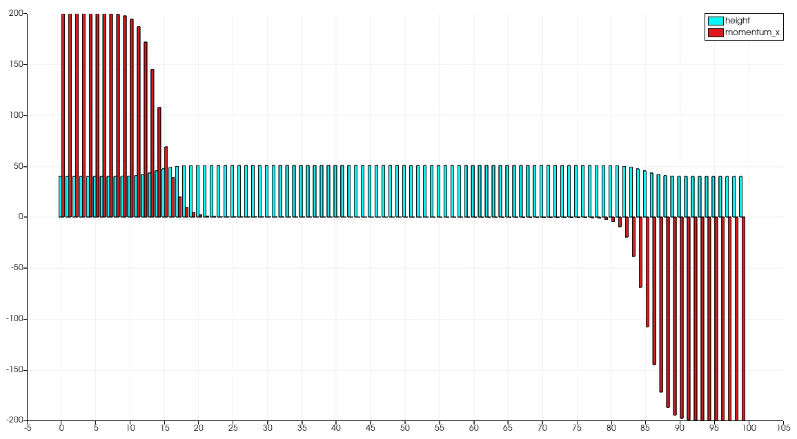
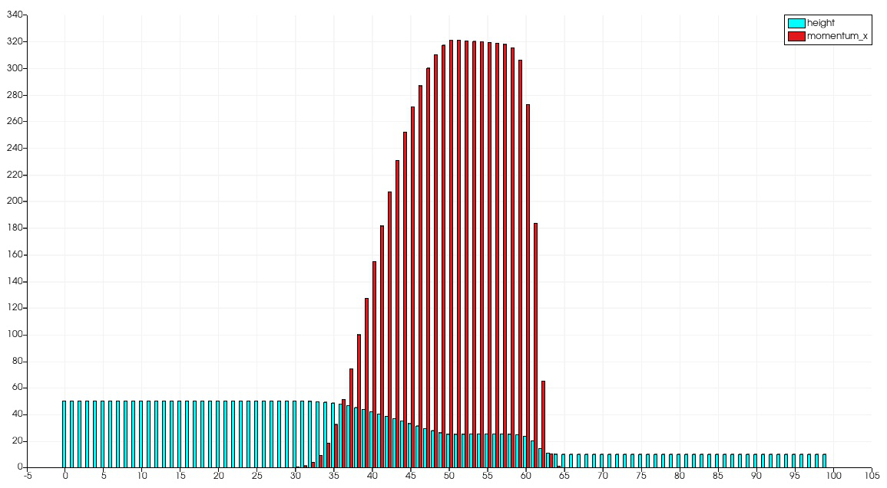
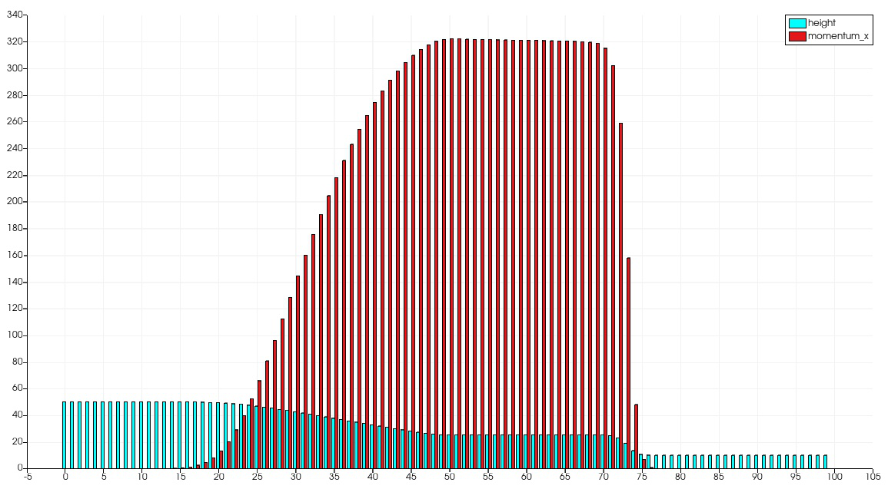
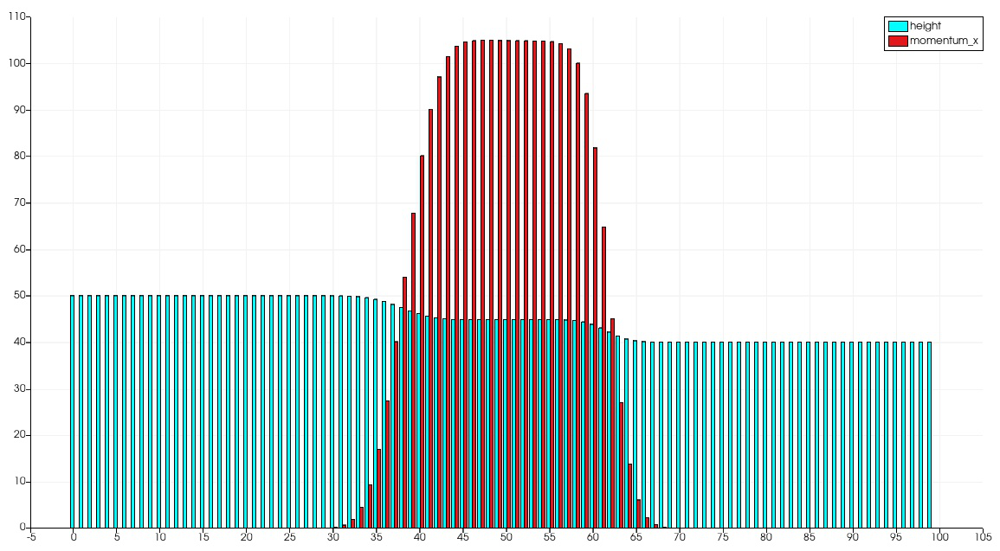
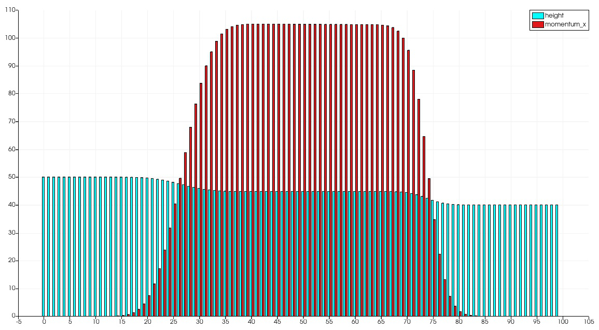

2 Finite Volume Discretization
==============================

Links:
------------

`Github Repo <https://github.com/MherMnatsakanyan03/tsunami_lab.git>`_

Individual Contributions:
-------------------------

Mher Mnatsakanyan and Maurice Herold did a similar amount of work.

Task 2.0:
-------------------------

2.0.1 FWave Solver Integration
^^^^^^^^^^^^^^^^^^^^^^^^^^^^^^

| Extended main-function to accept optional arguments: :code:`-v SOLVER` and :code:`-s SETUP`
| The syntax looks like this:
|   :code:`-v <fwave OR roe>`
|   :code:`-s <'dambreak hl hr' OR 'shockshock h m' OR 'rarerare h m'>`
| defaults are :code:`FWave` and :code:`'dambreak 15 7'` respectively

.. code:: c++

  while ((opt = getopt(i_argc, i_argv, "s:v:")) != -1)
    {
        switch (opt)
        {
        case 'v':
        {
            if (std::string(optarg) == "roe")
            {
                std::cout << "using roe-solver" << std::endl;
                solver_choice = "roe";
            }
            else if (std::string(optarg) == "fwave")
            {
                std::cout << "using fwave-solver" << std::endl;
                solver_choice = "fwave";
            }
            else
            {
                std::cerr
                    << "unknown solver "
                    << std::string(optarg) << std::endl
                    << "possible options are: 'roe' or 'fwave'" << std::endl
                    << "be sure to only type in lower-case" << std::endl;
                return EXIT_FAILURE;
            }
            break;
        }
        case 's':
        {
            std::string argument(optarg);
            std::vector<std::string> tokens;
            std::string intermediate;

            // Create a stringstream object
            std::stringstream check1(argument);

            // Tokenizing w.r.t. the delimiter ' '
            while (getline(check1, intermediate, ' '))
            {
                tokens.push_back(intermediate);
                std::cout << intermediate << std::endl;
            }

            // ensure that segmentation fault is not caused
            if (tokens.size() == 3)
            {
                // convert to t_real
                double l_arg1, l_arg2;
                try
                {
                    l_arg1 = std::stof(tokens[1]);
                    l_arg2 = std::stof(tokens[2]);
                }
                // if input after the name isn't a number, then throw an error
                catch (const std::invalid_argument &ia)
                {
                    std::cerr
                        << "Invalid argument: " << ia.what() << std::endl
                        << "be sure to only type numbers after the solver-name" << std::endl;
                    return EXIT_FAILURE;
                }

                if (tokens[0] == "dambreak")
                {
                    std::cout << "using DamBreak1d(" << l_arg1 << ", " << l_arg2 << ", 5) setup" << std::endl;
                    l_setup = new tsunami_lab::setups::DamBreak1d(l_arg1,
                                                                  l_arg2,
                                                                  5);
                }
                else if (tokens[0] == "shockshock")
                {
                    std::cout << "using ShockShock1d(" << l_arg1 << ", " << l_arg2 << ", 5) setup" << std::endl;
                    l_setup = new tsunami_lab::setups::ShockShock1d(l_arg1,
                                                                    l_arg2,
                                                                    5);
                }
                else if (tokens[0] == "rarerare")
                {
                    std::cout << "using RareRare1d(" << l_arg1 << "," << l_arg2 << ", 5) setup" << std::endl;
                    l_setup = new tsunami_lab::setups::RareRare1d(l_arg1,
                                                                  l_arg2,
                                                                  5);
                }
                // if input isn't a defined setup, throw an error
                else
                {
                    std::cerr
                        << "Undefined setup: " << tokens[0] << std::endl
                        << "possible options are: 'dambreak', 'shockshock' or 'rarerare'" << std::endl
                        << "be sure to only type in lower-case" << std::endl;
                    return EXIT_FAILURE;
                }
            }
            else
            {
                // if input doesn't follow the regulations "<name> <arg1> <arg2>"
                std::cerr
                    << "False number of arguments for setup: " << tokens.size() << std::endl
                    << "Expected: 3" << std::endl;
                return EXIT_FAILURE;
            }
            break;
        }
        // unknown option
        case '?':
        {
            std::cerr
                << "Undefinded option: " << char(optopt) << std::endl
                << "possible options are:" << std::endl
                << "  -v SOLVER = 'roe','fwave', default is 'fwave'" << std::endl
                << "  -s SETUP  = 'dambreak h_l h_r','rarerare h hu','shockshock h hu', default is 'dambreak 15 7'" << std::endl;
            break;
        }
        }
    }

    //...

    //
        l_waveProp->timeStep(l_scaling, solver_choice);
    //

The actual integration happens in the :code:`timeStep` function:

.. code:: c++

    if (solver_choice == "roe")
        {
            solvers::Roe::netUpdates(l_hOld[l_ceL],
                                     l_hOld[l_ceR],
                                     l_huOld[l_ceL],
                                     l_huOld[l_ceR],
                                     l_netUpdates[0],
                                     l_netUpdates[1]);
        }
        else if (solver_choice == "fwave")
        {
            solvers::FWave::netUpdates(l_hOld[l_ceL],
                                       l_hOld[l_ceR],
                                       l_huOld[l_ceL],
                                       l_huOld[l_ceR],
                                       l_netUpdates[0],
                                       l_netUpdates[1]);
        }
        else
        {
            throw std::invalid_argument("Not a valid solver. Try again with either 'roe' or 'fwave'.");
        }

2.0.2 Sanity Check
^^^^^^^^^^^^^^^^^^

Added new testcases for the setups with the values of middle_states.csv.
For more details, look up `WavePropagation1d.test.cpp <https://github.com/MherMnatsakanyan03/tsunami_lab/blob/main/src/patches/WavePropagation1d.test.cpp>`_

2.0.3 Continous Integration
^^^^^^^^^^^^^^^^^^^^^^^^^^^

Github-Actions are activated. With this, on every commit the servers will run the tests for us and notify us, if there happened to be an error.
That also means, that the *.yml*-file needed to be adjustet, so that the :code:`build`-command is correct.

Task 2.1:
-------------------------

2.1.1 shock-shock and rare-rare setups
^^^^^^^^^^^^^^^^^^^^^^^^^^^^^^^^^^^^^^

The implementation is almost identical to the dam-break, except that instead of the height we have the deciding parameter for a reversed sign in at the momentum:

.. code:: c++

    tsunami_lab::t_real tsunami_lab::setups::ShockShock1d::getMomentumX(t_real i_x,
                                                                    t_real) const
    {
    if (i_x < m_locationCenter)
    {
        return m_momentum;
    }
    else
    {
        return -(m_momentum);
    }
    }

2.1.2 influence of height/momentum on shock-shock and rare-rare setups
^^^^^^^^^^^^^^^^^^^^^^^^^^^^^^^^^^^^^^^^^^^^^^^^^^^^^^^^^^^^^^^^^^^^^^

We were able to observe that changing the momentum doesn't affect the speed of the wave. The speed in this case
is the jump on the x-axis over one frame-change. On the other hand, changing the height does have an effect on
the speed.
This also matches the expectations, since the math is suggesting that the momentum gets cancled out:

.. math::
  h_r &= h_l\ \land\ hu_r = -hu_l\ \Rightarrow\ u_r = -u_l \\
  h &= \frac{1}{2}(h_l+h_r) = h_l = h_r \\
  u &= \frac{u_l \sqrt{h_l} + u_r \sqrt{h_r}}{\sqrt{h_l}+\sqrt{h_r}} = \frac{u_l \sqrt{h_l} - u_l \sqrt{h_l}}{2\sqrt{h_l}} = 0 \\
  \lambda_{1,2} &= 0 \pm \sqrt{gh}

|pic1| |pic2|

Shock-Shock problem with h=10 and m=50 -> u=5 in two following timeframes.

|pic3| |pic4|

Shock-Shock problem with h=10 and m=100 -> u=10 in two following timeframes.

|pic5| |pic6|

Shock-Shock problem with h=40 and m=200 -> u=5 in two following timeframes.

Task 2.2:
-------------------------

2.2.1 influence of hl/hr on dambreak-momentum
^^^^^^^^^^^^^^^^^^^^^^^^^^^^^^^^^^^^^^^^^^^^^

| The momentum is larger, the larger the initial difference in height is.
| The shock-wave seems slower the larger the initial height difference is.

|pic7| |pic8|

Dam-Break problem with h_r=50 and h_r=10 in two following timeframes.

|pic9| |pic10|

Dam-Break problem with h_r=50 and h_r=40 in two following timeframes.

2.2.2 Village Evacuation Time
^^^^^^^^^^^^^^^^^^^^^^^^^^^^^

| The simulation showed the shock-wave moving to the edge from frame 4 to 11. This means that out of the :math:`1.25s` it took the wave :math:`\frac{4}{11}`th of that time to move :math:`4.75m`. 
|   :math:`t = \frac{4}{11} \cdot 1.25s = 0.45s`
| That makes the speed roughly :math:`v_{shock wave} \approx \frac{4.75m}{0.45s} \approx 11.6 \frac{m}{s} \approx 41.76 \frac{km}{h}`.

And it should arrive at the village after :math:`t_{evacuation} = \frac{25km}{41.76 \frac{km}{h}} = 0.6 h \approx 36 min`.

It should be noted, that the simulation so far does not consider :math:`hu_{r}=0.7`

Mathematically, the answer should look like this:

.. math::

  s_{village} &= 25km \\\\
  q_l &= \begin{bmatrix} 14 \\ 0 \end{bmatrix},\ q_r = \begin{bmatrix} 3.5 \\ 0.7 \end{bmatrix}\\
  u_r &= \frac{hu_r}{h_r} = \frac{0.7}{3.5} = 0.2 \frac{m}{s}\\\\
  h^{Roe} &= \frac{1}{2} (h_l + h_r) = \frac{1}{2} (14 + 3.5) = 8.75 m \\
  u^{Roe} &= \frac{u_l \sqrt{h_l} + u_r \sqrt{h_r}}{\sqrt{h_l}+\sqrt{h_r}} = \frac{0 \cdot \sqrt{14} + 0.2 \cdot \sqrt{3.5}}{\sqrt{14}+\sqrt{3.5}} = 0.06667 \frac{m}{s}\\\\
  \lambda_r^{Roe} &= u^{Roe} + \sqrt{gh^{Roe}} = 0.06667 + \sqrt{9.80665 \cdot 8.75} = 9.32994 \frac{m}{s} = 33.587784 \frac{km}{h} \\	
  t_{evacuation} &= \frac{s_{village}}{\lambda_r^{Roe}} = \frac{25}{33.587784} = 0.744 h = 44.64 min

The order of magnitude seems correct, which (including the fact that the time was eye-balled) implies possible correctness.