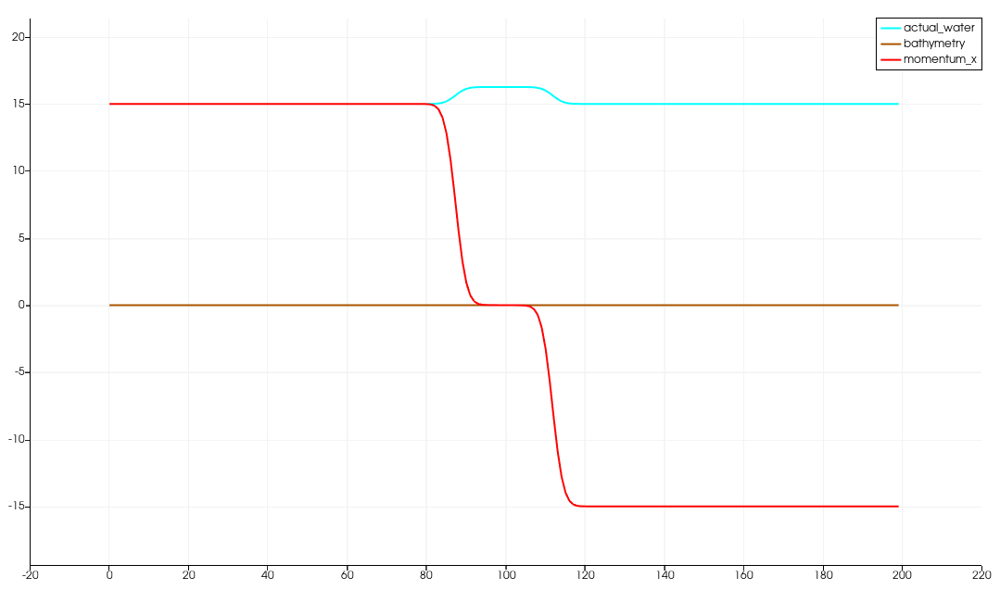
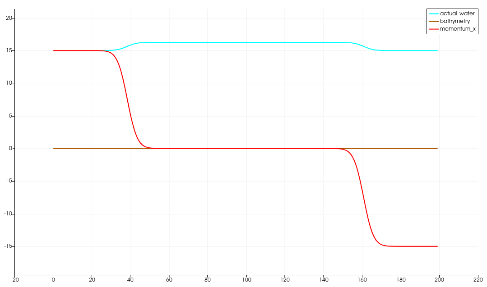
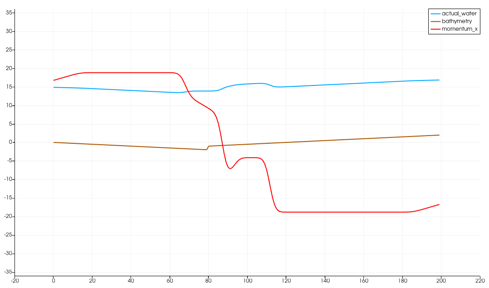
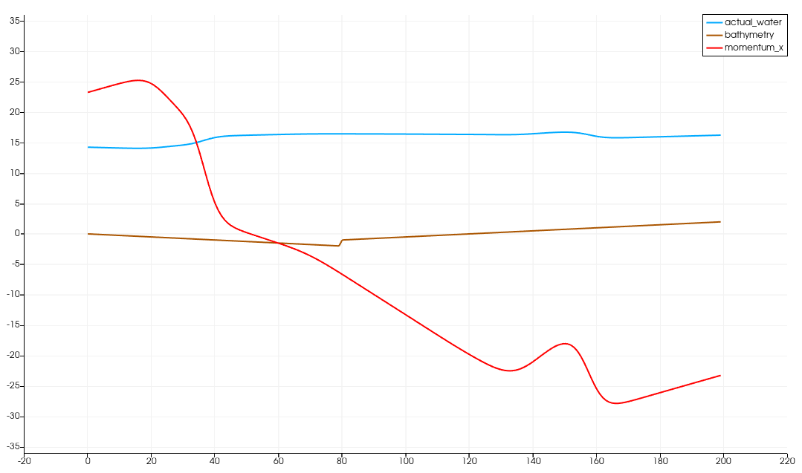
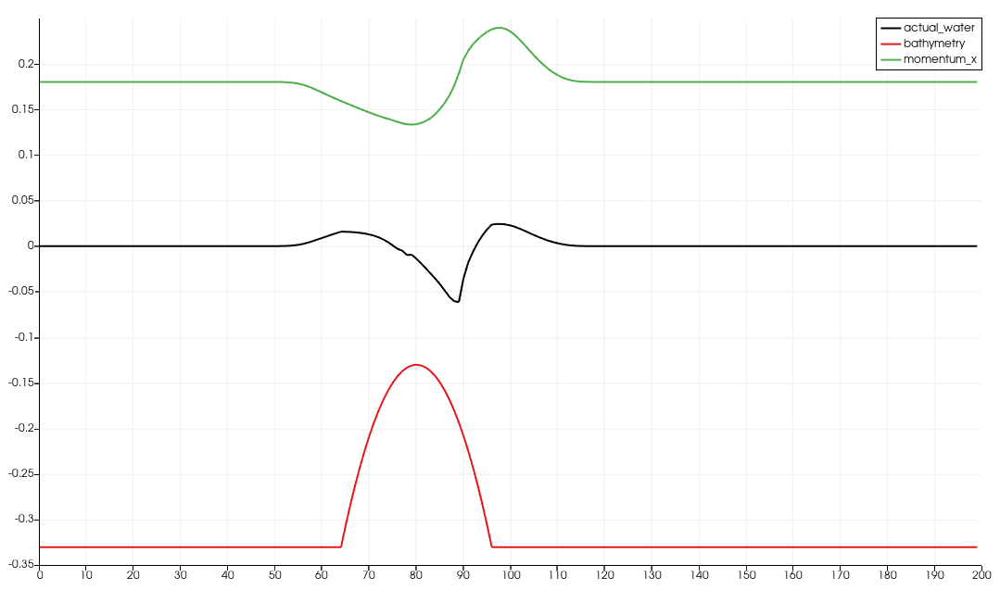
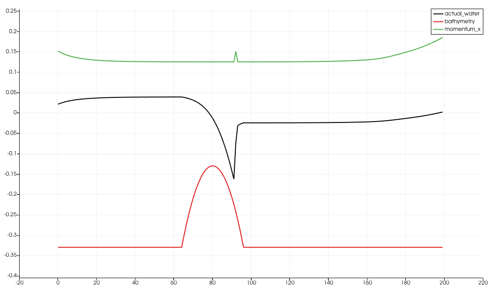

3 Bathymetry & Boundary Conditions
==================================

Links:
------------

`Github Repo <https://github.com/MherMnatsakanyan03/tsunami_lab.git>`_

Individual Contributions:
-------------------------

Mher Mnatsakanyan and Maurice Herold did a similar amount of work.

Task 3.1:
-------------------------

3.1.1 FWave Extension
^^^^^^^^^^^^^^^^^^^^^
The solver was extended by a function, that calculates :math:`\Delta x \Psi`:

.. code:: c++

    void tsunami_lab::solvers::FWave::deltaXPsi(t_real i_hL,
                                                t_real i_hR,
                                                t_real i_bL,
                                                t_real i_bR,
                                                t_real *o_deltaXPsi)
    {
        o_deltaXPsi[0] = 0;
        o_deltaXPsi[1] = -1 * m_g * (i_bR - i_bL) * (i_hL + i_hR) * 0.5;
    }

Which is used in the :code:`Wavestrength` function like so:

.. code:: c++

    t_real l_fluxL[2] = {0};
    t_real l_fluxR[2] = {0};

    flux(i_hL, i_huL, l_fluxL);
    flux(i_hR, i_huR, l_fluxR);

    t_real l_deltaXPhi[2] = {0};

    deltaXPhi(i_hL, i_hR, i_bL, i_bR, l_deltaXPhi);

    t_real l_fluxJump[2];

    l_fluxJump[0] = l_fluxR[0] - l_fluxL[0] - l_deltaXPhi[0];
    l_fluxJump[1] = l_fluxR[1] - l_fluxL[1] - l_deltaXPhi[1];

3.1.2 Shock-Shock with Bathymetry
^^^^^^^^^^^^^^^^^^^^^^^^^^^^^^^^^

|pic1| |pic2|

Shock-Shock problem with bathymetry = 0

|pic3| |pic4|

Shock-Shock problem with added bathymetry in form of:

.. code:: c++
 
    tsunami_lab::t_real tsunami_lab::setups::ShockShock1d::getBathymetry(t_real i_x,
                                                                         t_real) const
    {
        if (i_x < m_locationCenter - 1)
        {
            return -i_x * 0.5;
        }
        else
        {
            return i_x * 0.5 - 3;
        }
    }

Task 3.2:
-------------------------

3.2.1 Reflecting boundary conditions
^^^^^^^^^^^^^^^^^^^^^^^^^^^^^^^^^^^^

For this, we had to change the fwave-solver and the wave-prop ghost-cells, so that the needed condition was set at the edge and at wet/dry changes

For the Ghost-cells:

.. code:: c++

    // set left boundary
    switch (m_state_boundary_left)
    {
    // open
    case 0:
        l_h[0] = l_h[1];
        l_hu[0] = l_hu[1];
        l_b[0] = l_b[1];
        break;
    // closed
    case 1:
        l_h[0] = l_h[1];
        l_hu[0] = -l_hu[1];
        l_b[0] = l_b[1];
        break;

    default:
        break;
    }

    // set right boundary
    switch (m_state_boundary_right)
    {
    // open
    case 0:
        l_h[m_nCells + 1] = l_h[m_nCells];
        l_hu[m_nCells + 1] = l_hu[m_nCells];
        l_b[m_nCells + 1] = l_b[m_nCells];
        break;
    // closed
    case 1:
        l_h[m_nCells + 1] = l_h[m_nCells];
        l_hu[m_nCells + 1] = -l_hu[m_nCells];
        l_b[m_nCells + 1] = l_b[m_nCells];
        break;

    default:
        break;
    }

The Change between open/closed happens with options :code:`-l` (left) and :code:`-r` (right). See user-doc for more information.

And in FWave:

.. code:: c++

    // both sides are dry -> exit 0
    if (i_hL <= 0 && i_hR <= 0)
    {
        o_netUpdateL[0] = 0;
        o_netUpdateL[1] = 0;
        o_netUpdateR[0] = 0;
        o_netUpdateR[1] = 0;
        return;
    }

    // if dry, then no need to update
    bool do_update_left = true;
    bool do_update_right = true;

    // left side dry -> reflect to right
    if (i_hL <= 0)
    {
        i_hL = i_hR;
        i_huL = -i_huR;
        i_bL = i_bR;
        do_update_left = false;
    }
    // right side dry -> reflect to left
    else if (i_hR <= 0)
    {
        i_hR = i_hL;
        i_huR = -i_huL;
        i_bR = i_bL;
        do_update_right = false;
    }

3.2.2 Shock-Shock-similarities
^^^^^^^^^^^^^^^^^^^^^^^^^^^^^^

A test-case was added to the solver, which simulates the dry-wet condition and compares it to a simulated shock-shock condition:

.. code:: c++
    
    TEST_CASE("Test the derivation of the FWave net-updates dry-to-wet edge-case.", "[FWaveUpdatesWetDry]")
    {
        float l_netUpdatesL_dry_to_wet[2] = {-5, 3};
        float l_netUpdatesR_dry_to_wet[2] = {4, 7};
        float l_netUpdatesL_shock_shock[2] = {-5, 3};
        float l_netUpdatesR_shock_shock[2] = {4, 7};

        // Simulate wave against wall right to left
        tsunami_lab::solvers::FWave::netUpdates(0,
                                                15,
                                                0,
                                                -10,
                                                15,
                                                -15,
                                                l_netUpdatesL_dry_to_wet,
                                                l_netUpdatesR_dry_to_wet);

        // Simulate shock-shock wave
        tsunami_lab::solvers::FWave::netUpdates(15,
                                                15,
                                                10,
                                                -10,
                                                -15,
                                                -15,
                                                l_netUpdatesL_shock_shock,
                                                l_netUpdatesR_shock_shock);

        REQUIRE(l_netUpdatesL_dry_to_wet[0] == 0);
        REQUIRE(l_netUpdatesL_dry_to_wet[1] == 0);

        // Proof, that same effect as shock-shock happens
        REQUIRE(l_netUpdatesR_dry_to_wet[0] == Approx(l_netUpdatesR_shock_shock[0]));
        REQUIRE(l_netUpdatesR_dry_to_wet[1] == -Approx(l_netUpdatesL_shock_shock[1]));
    }

Task 3.3:
-------------------------

3.3.1 Maximum Fraude Number
^^^^^^^^^^^^^^^^^^^^^^^^^^^

:math:`F(x)=\frac{u}{\sqrt{gh}}` gets bigger, if :math:`u` gets bigger or :math:`h` gets smaller.

:math:`F_{sub}(x)=\frac{ \frac{4.42}{h_{sub}} }{ \sqrt{ gh_{sub} } } = \frac{4.42}{ \sqrt{ gh_{sub} } \cdot h_{sub} }`

and

:math:`F_{super}(x)=\frac{ \frac{0.18}{h_{super}} }{ \sqrt{ gh_{super} } } = \frac{0.18}{ \sqrt{ gh_{super} } \cdot h_{super} }`

:math:`h` needs to get minimal.

:math:`\min(h_{sub}) = -\max(b_{sub})= 1.8`  and  :math:`\min(h_{super}) = -\max(b_{super})= 0.13`

:math:`\max(F_{sub}) = \frac{4.42}{\sqrt{9.81\cdot 1.8}\cdot 1.8}\approx 0.584358`  and  :math:`\max(F_{super}) = \frac{0.18}{\sqrt{9.81\cdot 0.13}\cdot 0.13}\approx 1.22609`

3.3.2 Super Sub
^^^^^^^^^^^^^^^^^^^

In a similar way to the other setups, `Subcritical1d.cpp <https://github.com/MherMnatsakanyan03/tsunami_lab/blob/main/src/setups/subcritical1d/Subcritical1d.cpp>`_
and `Supercritical1d.cpp <https://github.com/MherMnatsakanyan03/tsunami_lab/blob/main/src/setups/supercritical1d/Supercritical1d.cpp>`_
were implemented. This time, a lot of the values are constants, depending where :code:`i_x` is.

3.3.3 Visual representation
^^^^^^^^^^^^^^^^^^^^^^^^^^^

|pic5| |pic6|

In the simulation spike happens at 91 to 93 with the spike-max being at 92.
This spike represents the failed attempt to converge to the analytically expected constant momentum,
which can be seen everywhere else inside the domain.

Task 3.4:
-------------------------

3.4.1 Data-Extraction
^^^^^^^^^^^^^^^^^^^^^

3.4.2 Csv-In
^^^^^^^^^^^^

3.4.3 Tsunami-Setup
^^^^^^^^^^^^^^^^^^^^^

3.4.4 Tsunami-Visualisation
^^^^^^^^^^^^^^^^^^^^^^^^^^^