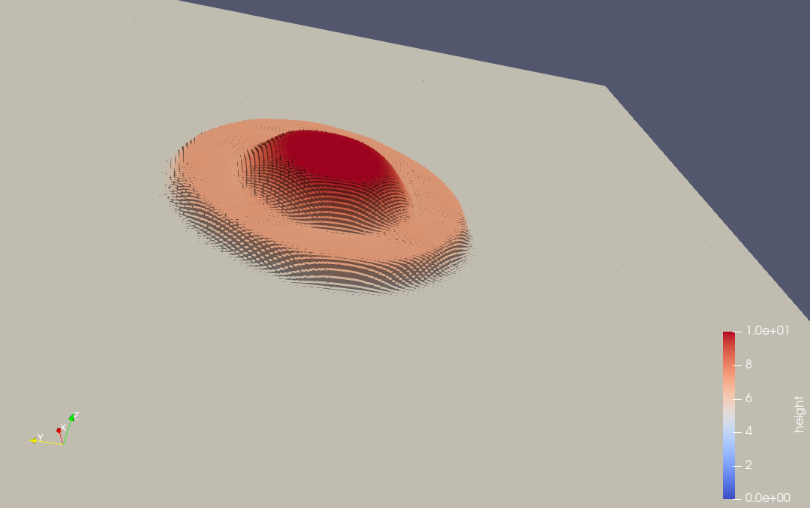
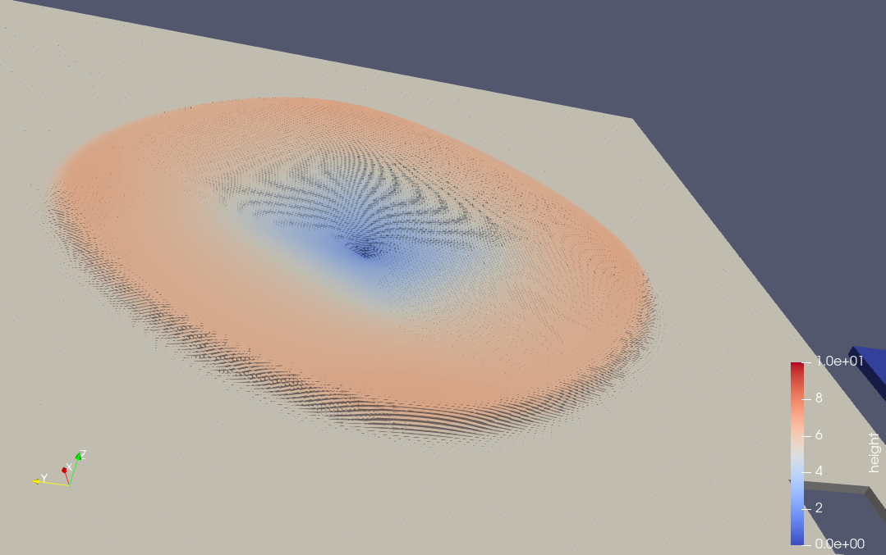
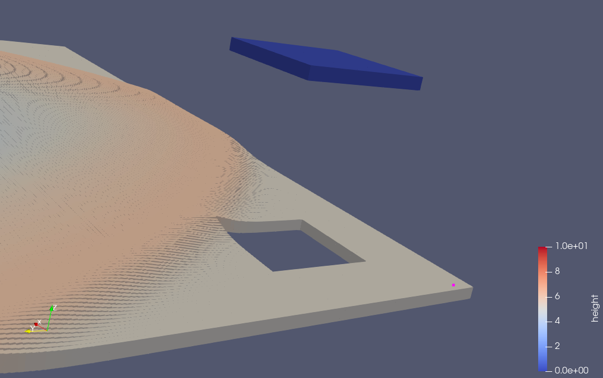
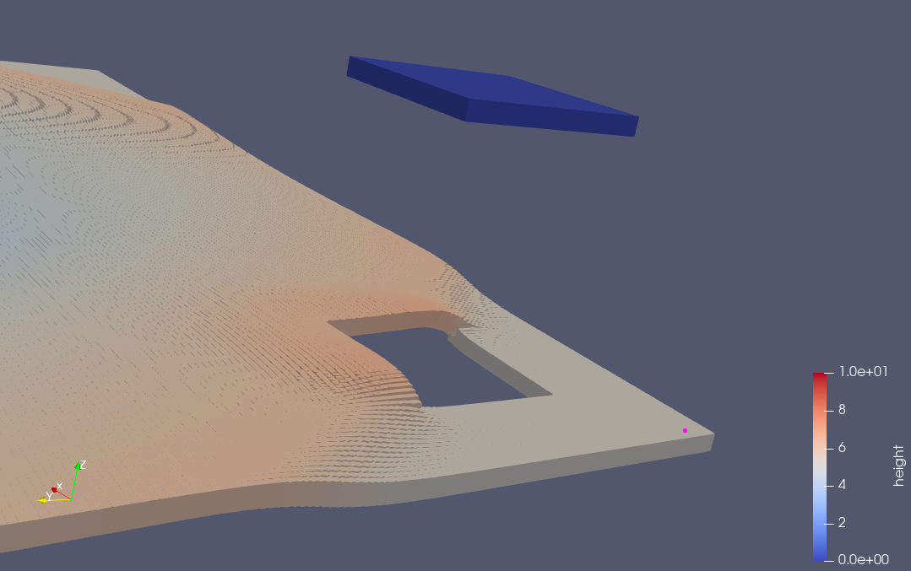

4 Two Dimensional solver
========================

Links:
------------

`Github Repo <https://github.com/MherMnatsakanyan03/tsunami_lab.git>`_

Individual Contributions:
-------------------------

Mher Mnatsakanyan and Maurice Herold did a similar amount of work.

Task 4.1:
---------

4.1.1 2D support
^^^^^^^^^^^^^^^^
We started by trying to implement a solution using 2d-arrays in c++ ie. :code:`t_real **m_b`.
This soon showed to be rather difficult because a lot of implementation thus far
were based on one-dimensional arrays, for instance the :code:`WavePropagation.h` needed
to be rewritten and :code:`Csv.cpp` would also require a complete overhaul.

There is an easier way, which is to flatten the 2d-grid onto a 1d-array. This just
requires a way to map x-y coordinates to a numeric value. Luckly this is easy because
we just need to jump for every y-coordinate one x-axis amout in the array. We achieved
this by writing a helper-function that does the calculation for us:

.. code:: c++

    t_idx getCoordinates(t_idx i_x, t_idx i_y)
    {
        // when trying to move on a flattend 2d plane, for each y-coordinate
        // we need to "jump" one x-axis worth of a distance in the 1d-array
        return i_x + i_y * getStride();
    };

This way we could also guarantee the compatibility of our code with 1d-setups.

Now, you have to use the :code:`DIMENSION` and :code:`SETUP` options, because
setting default values is hard, considering that there is the possibility of
mismatching dimension and setup.

Another change that had to be done was the inclusion of the y-parameter in :code:`Csv.cpp`
with consideration to the given dimension.

.. code:: c++

    int x_ghost_cell = 0;
    int y_ghost_cell = 0;
    // write the CSV header
    io_stream << "x,y";
    if (i_h != nullptr)
        io_stream << ",height";
    if (i_hu != nullptr)
    {
        io_stream << ",momentum_x";
        x_ghost_cell = 1;
    }
    if (i_hv != nullptr)
    {
        io_stream << ",momentum_y";
        y_ghost_cell = 1;
    }
    if (i_b != nullptr)
        io_stream << ",bathymetry";
    io_stream << "\n";

    // iterate over all cells
    for (t_idx l_iy = y_ghost_cell; l_iy < i_ny + y_ghost_cell; l_iy++)
    {
        for (t_idx l_ix = x_ghost_cell; l_ix < i_nx + x_ghost_cell; l_ix++)
        {
        // derive coordinates of cell center
        t_real l_posX = (l_ix + 0.5 - x_ghost_cell) * i_dxy + i_x_offset;
        t_real l_posY = (l_iy + 0.5 - y_ghost_cell) * i_dxy + i_y_offset;

        t_idx l_id = l_iy * i_stride + l_ix;

        // ...
    }

4.1.2 2D Dambreak
^^^^^^^^^^^^^^^^^

The implementation of the 2D-Dambreak setup is not very much different to the regular setups.
This time we are using both the :code:`i_x` and :code:`i_y` coordinate:

.. code:: c++

    tsunami_lab::t_real tsunami_lab::setups::DamBreak2d::getHeight(t_real i_x,
                                                                   t_real i_y) const
    {
        // move circle by amount
        t_real x_offset = i_x - 50;
        t_real y_offset = i_y - 50;
        if (getBathymetry(i_x, i_y) > 0)
        {
            return 0;
        }
        if (std::sqrt(x_offset * x_offset + y_offset * y_offset) < 10)
        {
            return 10;
        }
        else
        {
            return 5;
        }
    }

Here is the graphical illustration:

|pic1| |pic2|

4.1.3 2D Dambreak + Bathymetrie
^^^^^^^^^^^^^^^^^^^^^^^^^^^^^^^

At first, we tried to add a cylinder shaped obstacle onto the grid. This caused the simulation
to break, because some values were ended up being nan or inf. 

.. code:: c++
 
    {
        // move circle by amount
        t_real x_offset = i_x - 10;
        t_real y_offset = i_y - 25;
        if (std::sqrt(x_offset * x_offset + y_offset * y_offset) < 3)
        {
            return 10;
        }
        else
        {
            return -10;
        }
    }

Which is why we then implemented a simple cubic-shaped obstacle in the following manner:

.. code:: c++

    tsunami_lab::t_real tsunami_lab::setups::DamBreak2d::getBathymetry(t_real i_x,
                                                                       t_real i_y) const
    {
        int offset = -10;
        if (i_x + offset < 5 && i_x + offset > -5 && i_y + offset < 5 && i_y + offset > -5)
        {
            return 10;
        }
        else
        {
            return -10;
        }
    }    

Here is the graphical illustration:

|pic3| |pic4|

Task 4.2: Implementing the tsunami_lab::io::Stations Class

    4.2.1 & 4.2.2 Creation of the tsunami_lab::io::Stations Class

It's designed to manage and process data for a collection of observation stations, each uniquely identified and positioned in the simulation space.

Loading Stations from a JSON File

The configuration and initialization of these stations are handled through a JSON file, providing a structured and flexible way to define station attributes. The loadStationsFromJSON method, automatically called during the class's construction, parses this file to set up each station.

.. code:: c++
    void tsunami_lab::io::Stations::loadStationsFromJSON(const std::string &filePath)
    {
        std::ifstream file(filePath);
        nlohmann::json j;
        file >> j;

        m_outputFrequency = j["outputfrequency"];

        for (const auto &station : j["stations"])
        {
            std::string name = station["name"];
            t_real x = station["x"];
            t_real y = station["y"];
            addStation(name, x, y);
        }
    }

In this method, each station's name and coordinates are extracted from the JSON file and added to the class's internal vector using the addStation method. This vector is a collection of Station_struct objects, each representing an individual station with its name and spatial coordinates.

Data Recording via writeStationOutput

One of the core functionalities of this class is the writeStationOutput method. It's responsible for writing simulation data for each station into individual CSV files, provided the station lies within the simulation area's bounds. This method is crucial for gathering and storing simulation results in an organized and accessible format.

.. code:: c++
    void tsunami_lab::io::Stations::writeStationOutput(t_real i_dxy,
                                                    t_idx i_nx,
                                                    t_idx i_ny,
                                                    t_real i_x_offset,
                                                    t_real i_y_offset,
                                                    t_idx i_stride,
                                                    t_real const *i_h,
                                                    t_real const *i_hu,
                                                    t_real const *i_hv,
                                                    t_real const *i_b,
                                                    t_real i_time)
    {

        for (const auto &station : m_stations)
        {
            t_idx l_ix = (station.m_x + i_x_offset) / i_dxy;
            t_idx l_iy = (station.m_y + i_y_offset) / i_dxy;
            t_idx l_id = l_ix + l_iy * i_stride;

            if (l_ix < i_nx && l_iy < i_ny)
            {
                std::ofstream file("station_data/" + station.m_name + ".csv", std::ios::app);
                if (file.is_open())
                {
                    file << i_time;
                    if (i_h != nullptr)
                        file << "," << i_h[l_id];
                    if (i_hu != nullptr)
                        file << "," << i_hu[l_id];
                    if (i_hv != nullptr)
                        file << "," << i_hv[l_id];
                    if (i_b != nullptr)
                        file << "," << i_b[l_id];
                    file << std::endl
                        << std::flush;
                }
            }
        }
    }

The method checks if each station is within the simulation grid. If a station is within the grid, the method writes various simulation parameters (like water height, momentum, bathymetry, etc.) into a CSV file named after the station. This conditional approach ensures that only relevant data is recorded, maintaining the integrity and relevance of the simulation data.

Additional Functionalities and Structures

addStation Method: Adds a new station to the stations vector, taking the station's name and coordinates as inputs.

getOutputFrequency Method: Returns the output frequency for data recording, ensuring uniform data collection intervals across different stations.

getStations Method: Provides access to the vector of stations, allowing other components of the simulation to interact with the station data.

