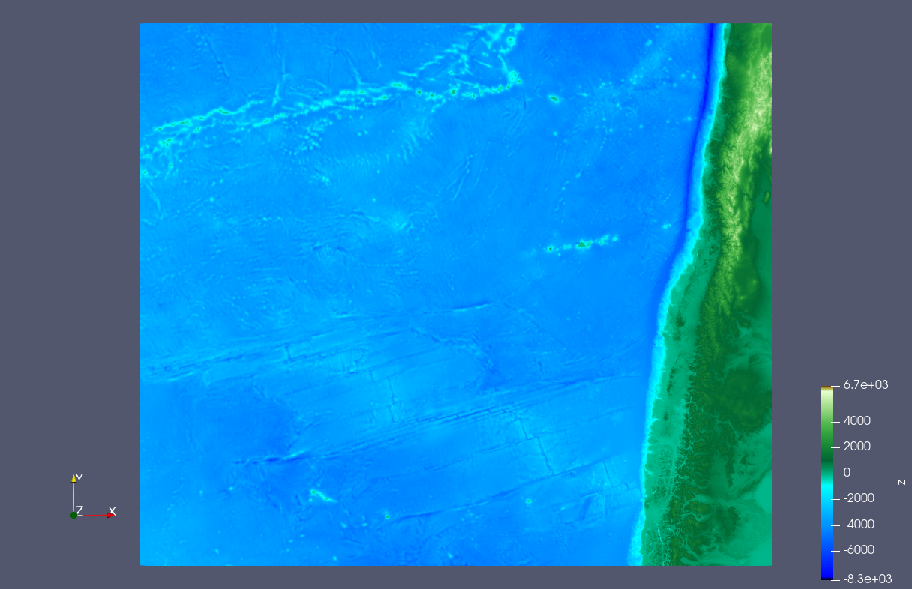
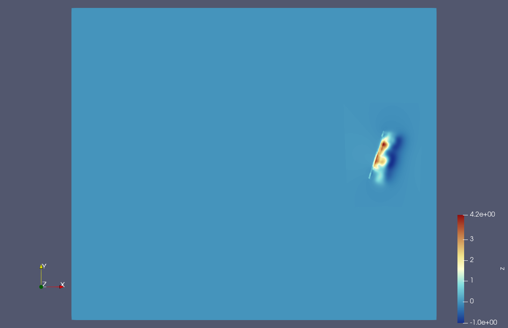
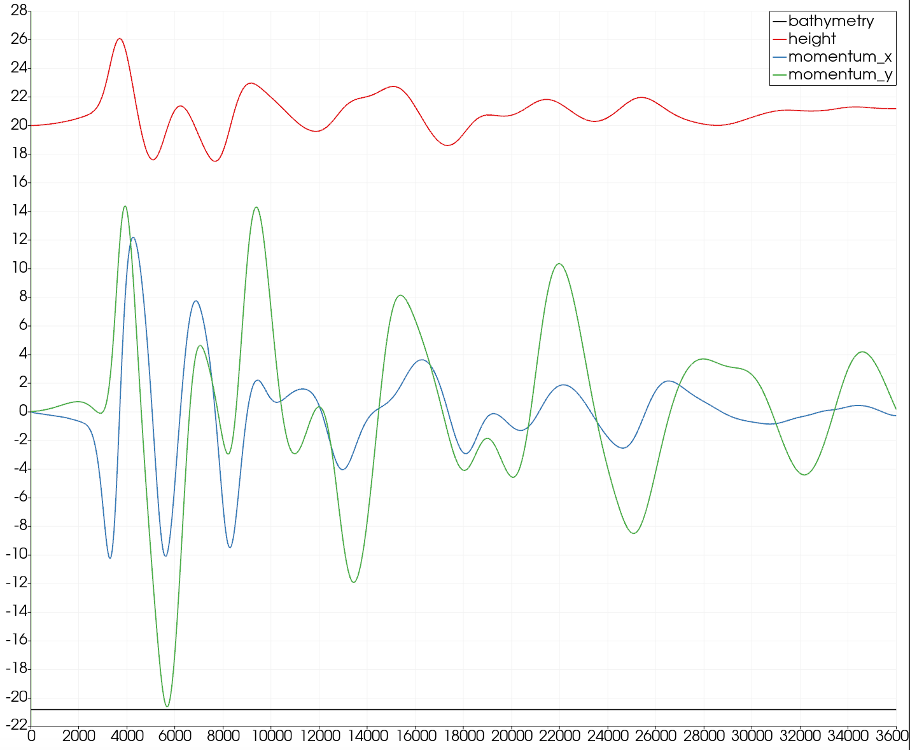

6 Tsunami Simulation
====================

Links:
------------

`Github Repo <https://github.com/MherMnatsakanyan03/tsunami_lab.git>`_

Individual Contributions:
-------------------------

Mher Mnatsakanyan and Maurice Herold did a similar amount of work.

We discovered a critical bug in our programm, which caused our entire simulation to crash after a certain point.
The simulation would calculate a non-number and continue the simulation with that. Visually, it looked like
a cancer that continued to grow until it took over the entire ocean.

The issue was a simple typo in the f-wave solver that made the reflection of the second wave disfunction. It
made the values add to negative infinity after a certain time. The corrected version looks like this:

.. code:: c++

    // 2nd wave
    if (l_sR > 0 && do_update_right) // Error was "l_sR < 0 && ..."
    {
        o_netUpdateR[l_qt] += l_waveR[l_qt];
    }
    else if (l_sR <= 0 && do_update_left)
    {
        o_netUpdateL[l_qt] += l_waveR[l_qt];
    }

The error caused that the second wave didn't simulate a negative (left-sided) movement, which removed a
possible reflection, which then caused the waves to reflect to one direction infinetly until the simulation broke
and we recieved nans.

This took a long time to find, which is the reason that our report this week is incomplete. We hope to update it
on the following monday (04.12.2003).

Task 6.1: 2010 M 8.8 Chile Event
--------------------------------

6.1.1 Make familiar
^^^^^^^^^^^^^^^^^^^

The following images show the provided data visually:

Here we can see the bathymetry of chile. We used the `colormap_topopgraphy_small.xml` colormap to visualize a real-looking land-mass.

This image represents the displacement that will be used to simulate the wave.

6.1.2 Simulation
^^^^^^^^^^^^^^^^

Computational demands:
We can get the theoretical demands by looking at how many net-updates we need to calculate
each frame and multipy that by the number of time-frames needed to be simulated.

.. math::

    \begin{align}
        Demand &= l\_nx \cdot l\_ny \cdot l\_timeSteps\\
        &= l\_nx \cdot l\_ny \cdot \frac{l\_endTime \cdot \sqrt{9.81 \cdot l\_hMax}}{0.5 \cdot l\_dxy}\\
        &\approx_{1000m} 3500 \cdot 2950 \cdot \frac{36000 \cdot \sqrt{9.81 \cdot 8300}}{0.5 \cdot 1000}\\
        &= 2.12 \cdot 10 ^{11}\\
    \end{align}

This is round-about the number of times the function :code:`netUpdate` needs to be called for a simulation of
Chile with a cell-size of 1000 and a simulation-time of 10 hours.

Be aware that the value will grow exponentially depending on how smaller the cell-size is and how long the simulation lasts.

.. todo:: 
    * Add more videos
    * When does the wave leave the domain?

Task 6.2: 2011 M 9.1 Tohoku Event
---------------------------------

6.2.1 Simulation
^^^^^^^^^^^^^^^^

.. math::

    \begin{align}
        Demand &= l\_nx \cdot l\_ny \cdot l\_timeSteps\\
        &= l\_nx \cdot l\_ny \cdot \frac{l\_endTime \cdot \sqrt{9.81 \cdot l\_hMax}}{0.5 \cdot l\_dxy}\\
        &\approx_{1000m} 2700 \cdot 1500 \cdot \frac{36000 \cdot \sqrt{9.81 \cdot 9700}}{0.5 \cdot 1000}\\
        &= 8.99 \cdot 10 ^{10}\\
    \end{align}

This is round-about the number of times the function :code:`netUpdate` needs to be called for a simulation of
Tohoku with a cell-size of 1000 and a simulation-time of 10 hours.

Be aware that the value will grow exponentially depending on how smaller the cell-size is and how long the simulation lasts.

The wave left the domain after around 8h, which is kinda hard to tell based on the video provided though.

.. video:: _static/content/videos/week6/tohoku_1000.mp4
   :width: 700
   :loop:
   :autoplay:
   :muted:

Video of Tohoku-simulation with cell-size set to 1000m.

.. video:: _static/content/videos/week6/tohoku_500.mp4
   :width: 700
   :loop:
   :autoplay:
   :muted:

Video of Tohoku-simulation with cell-size set to 500m.

6.2.2 Soma-Station
^^^^^^^^^^^^^^^^^^

In this section, we estimate the travel time of the first tsunami waves from the epicenter
of the 2011 M 9.1 Tohoku earthquake to Sõma, a town in Japan. The computation involves the
use of bathymetry data and a simple wave speed formula.

The dataset provided includes bathymetry measurements around the area of Sõma and the
epicenter of the Tohoku earthquake.

The wave speed :math:`L` at each point is calculated using the formula :math:`L = \sqrt{gh}`

Sõma is located approximately 54.6 km north and 127.6 km west of the earthquake's epicenter.
Using these coordinates, the straight-line distance to Sõma is computed. The average wave
speed derived from the bathymetry data is then used to calculate the travel time of the
tsunami waves to Sõma.

.. math::
    \begin{align}
        \text{Distance} &= \sqrt{\text{North}^2 + \text{West}^2}\\
        \text{Travel Time} &= \frac{\text{Distance}}{\text{Average Wave Speed}}
    \end{align}

Results:

* Distance to Sõma: 138.8 km
* Average Wave Speed: 86.64 m/s
* Travel Time to Sõma: Approximately 26.7 minutes

The simulation looked like the following:

