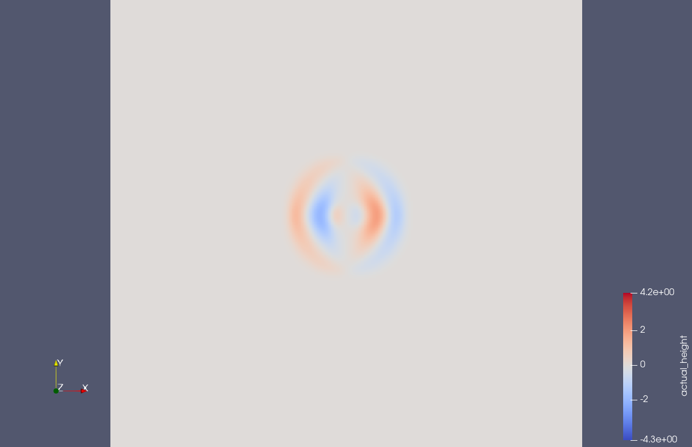
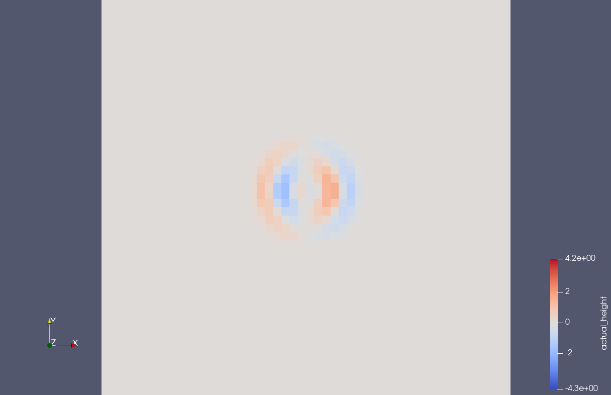
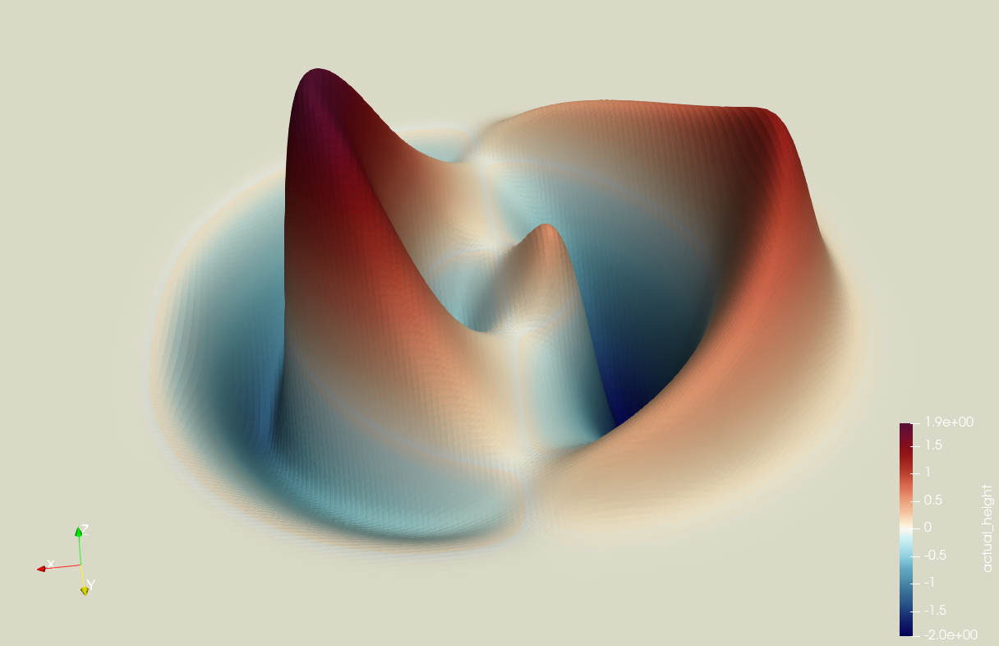
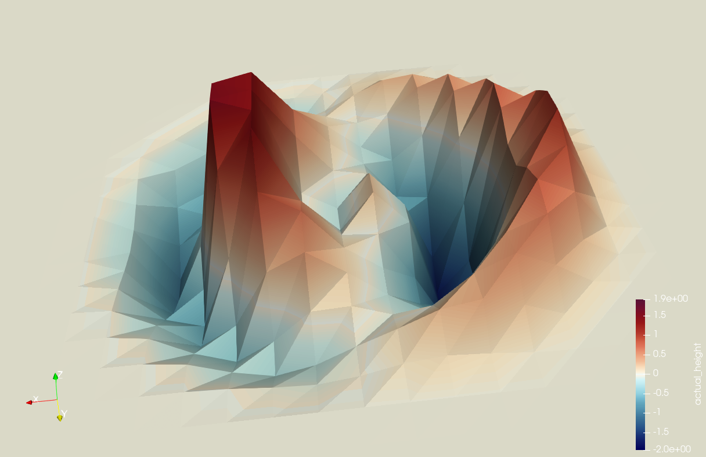

7 Checkpointing
===============

Links:
------------

`Github Repo <https://github.com/MherMnatsakanyan03/tsunami_lab.git>`_

Individual Contributions:
-------------------------

Mher Mnatsakanyan and Maurice Herold did a similar amount of work.

Task 7.1: Checkpointing
-----------------------

7.1.1 Extension
^^^^^^^^^^^^^^^

7.1.2 Setup
^^^^^^^^^^^

7.1.3 Test
^^^^^^^^^^

7.1.4 Extension 2
^^^^^^^^^^^^^^^^^

Task 7.2: Coarse Output
-----------------------

7.2.1 Coarsing
^^^^^^^^^^^^^^

For this task we wrote a private help-function which scales down an input-array by a given integer `i_resolution_div`
and calculates the average number inbetween the downscaling to get an acurate representation of the original array
on a smaller size.

.. code:: c++

    tsunami_lab::t_real *tsunami_lab::io::NetCdf::scaleDownArray(t_real const *i_array,
                                                                 t_idx i_nx,
                                                                 t_idx i_ny,
                                                                 int i_resolution_div)
    {
        t_idx new_nx = i_nx / i_resolution_div; 
        t_idx new_ny = i_ny / i_resolution_div; 
        t_real *new_array = new t_real[new_nx * new_ny];    
        
        for (t_idx j = 0; j < new_ny; ++j)
        {
            for (t_idx i = 0; i < new_nx; ++i)
            {
                t_real sum = 0;
                for (t_idx y = j * i_resolution_div; y < (j + 1) * i_resolution_div; ++y)
                {
                    for (t_idx x = i * i_resolution_div; x < (i + 1) * i_resolution_div; ++x)
                    {
                        sum += i_array[y * i_nx + x];
                    }
                }
                new_array[j * new_nx + i] = sum / (i_resolution_div * i_resolution_div);
            }
        }

        return new_array;
    }

|pic1| |pic2|

|pic3| |pic4|

The pictures represent an artificial Tsunami-setup with the original scaling (:math:`k=1`)
and a downscaled version (:math:`k=10`). The difference in file-size is 100x.

7.2.2 Simulation
^^^^^^^^^^^^^^^^

We admit that we completely lost sight of this task and forgot to run the simulation.
Considering the assignments last week the simulation would run normal. We open and close
the file at every writing operation which saves the file, making a simulation possible
even after a crash. The only thing not working yet is the actuall checkpointing.