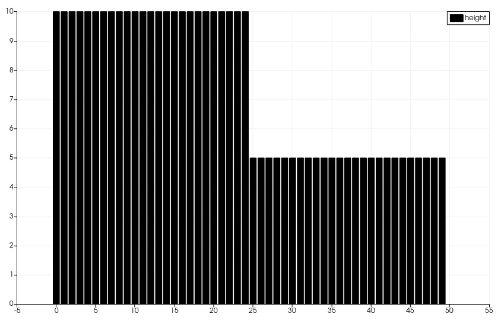
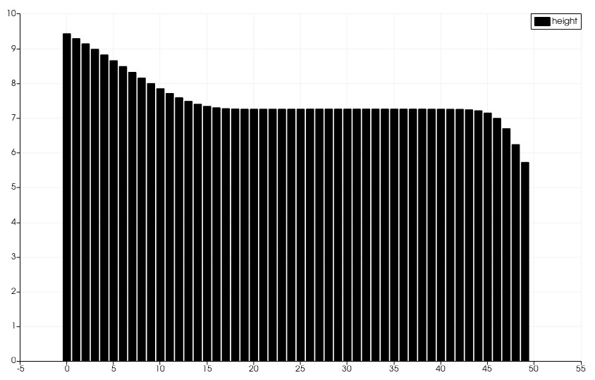
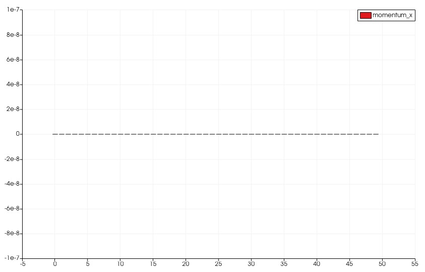
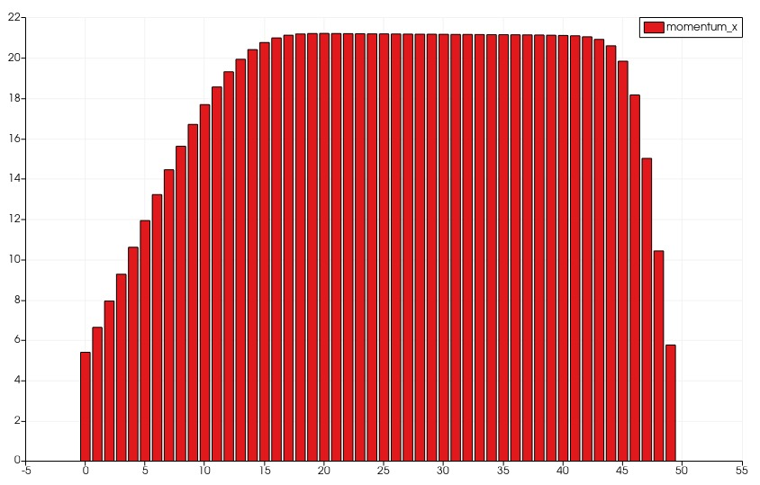

.. _ch:Task_1_1:

Report Week 1
==============
.. _ch:Contribution:
Contribution
------------
Bohdan Babii and Phillip Rothenbeck both made equal and significant contributions to 
Assignment 1 at the Tsunami Lab. Their collaboration and dedication to the project were 
evident throughout the process. 

.. _ch:User_Documentation:
User Documentation
------------------
The submitted code has not yet been integrated into the main application, so it cannot be 
used directly. However, you can test it separately using the scons build tool to ensure 
its functionality. The integration of this code into the main application is planned to 
be implemented in the next assignment.

.. _ch:Mathematics:
Mathematics
-----------

To implement the f-wave solver we used a class called F_Wave the only public method of F_Wave is called netUpdates, which calculates all netUpdates as required in the task. To calculate the netUpdates we need to compute each wave first, that again requires the wave speeds and wave strengths to be available. For which we wrote the private functions waveSpeeds and waveStrengths. Lastly we added the heightAvg and the particleVelocityAvg function to be able to calculate the wave speeds. 

Both heightAvg, which calculates average height of the left and the right cell, and particleVelocityAvg, computing the average particle velocity of both cells, are implemented as extra functions to increase readability.
This chapter implements and tests the most basic part of our project: The *f-wave* solver for the one-dimensional shallow water equations.
The shallow water equations are a system of nonlinear hyperbolic conservations laws with an optional source term:

.. math:: h(q_l, q_r) = \frac{1}{2}(h_l+h_r), u(q_l, q_r) = \frac{u_l\sqrt{h_l}+u_r\sqrt{h_r}}{\sqrt{h_l}+\sqrt{h_r}}.

The waveSpeeds function computes the roe eigenvalues (wave speeds of both waves) using the average height, average particle velocity and the gravity constant g.

.. math:: \lambda_{1, 2}=u(q_l, q_r)\mp\sqrt{g\cdot h(q_l, q_r)}

The waveStrengths function computes the wave strengths of both waves.

.. math:: \begin{bmatrix}\alpha_1 \\ \alpha_2 \end{bmatrix} = \begin{bmatrix}1 & 1\\ \lambda_1 & \lambda_2\end{bmatrix}^{-1}\Delta f 

To increase the readability we used the Variable inv_det that stores the inverse determinant.

.. math:: \frac{1}{\lambda_2-\lambda_1}\begin{bmatrix}\lambda_2 & -1\\ -\lambda_1 & 1\end{bmatrix} = \begin{bmatrix}\lambda_2\cdot inv\_det & -inv\_det\\ -\lambda_1\cdot inv\_det & inv\_det\end{bmatrix}\qquad

When we wrote out the matrix-vector multiplication we got formulas for each wave strength, which can be calculated easily by a computer.

.. math:: \alpha_1 = \lambda_2\cdot inv\_det\cdot (h_l- h_r) - inv\_det\cdot(hu_l-hu_r),\\ \alpha_2 = inv\_det\cdot(hu_l-hu_r)-\lambda_1\cdot inv\_det\cdot(h_l-h_r)

If the wave strength is greater than 0 it belongs to a wave is right-going which influences the right cell. And the other way around. We expect one wave to be right-going and on to be left-going. This way the left net update equals the left-going wave and the right net update is set to be the right going wave.

.. math:: netUpdate_{Left}= A^{-}\Delta Q = \begin{cases}Z_1\qquad\lambda_1<0\\ Z_2\qquad\lambda_2<0\end{cases} \\ netUpdate_{Right}= A^{+}\Delta Q = \begin{cases}Z_1\qquad\lambda_1>0\\ Z_2\qquad\lambda_2>0\end{cases} 

.. _ch:code:

Code
---------------
**FWave.h**
This code presents the 'F Wave' solver for one-dimensional shallow water equations. 
It offers a set of functions for essential computations in the context of shallow water 
wave modeling. These functions include averaging wave heights and velocities, 
calculating wave speeds, determining wave strengths, and computing net updates to system 
state variables.

.. code-block:: cpp
   :linenos:

   /**
    * @author Bohdan Babii, Phillip Rothenbeck
    *
    * @section DESCRIPTION
    * F Wave solver for the one-dimensional shallow water equations.
    **/

   #ifndef TSUNAMI_LAB_SOLVERS_F_WAFE
   #define TSUNAMI_LAB_SOLVERS_F_WAFE

   #include "../constants.h"

   namespace tsunami_lab {
       namespace solvers {
           class F_Wave;
       }
   }

   class tsunami_lab::solvers::F_Wave {
       private:

       //! square root of gravity
       static t_real constexpr c_sqrt_g = 3.131557121;

       /**
        * Computes the average wave height.
        *
        * @param i_hL height of the left side.
        * @param i_hR height of the right side.
        * @param o_hight will be set to the average speed.
        **/

       static void heightAvg(t_real i_hL,
                            t_real i_hR,
                            t_real &o_height);

       /**
        * Computes the average particle_Velocity
        *
         * @param i_hL height of the left side.
         * @param i_hR height of the right side.
         * @param i_huL momentum of the left side.
         * @param i_huR momentum of the right side.
         * @param o_velocity will be set to the average velocity.
        **/

       static void particleVelocityAvg(t_real i_hL,
                                    t_real i_hR,
                                    t_real i_uL,
                                    t_real i_uR,
                                    t_real &o_velocity);

        /**
	 * Computes the wave speeds.
	 *
         * @param i_hL height of the left side.
         * @param i_hR height of the right side.
         * @param i_huL momentum of the left side.
         * @param i_huR momentum of the right side.
         * @param o_speed_left will be set to the speed of the wave propagating to the left.
         * @param o_speed_right will be set to the speed of the wave propagating to the right.
        **/

	static void waveSpeeds(	t_real   i_hL,
				t_real   i_hR,
				t_real   i_uL,
				t_real   i_uR,
				t_real & o_wafeSpeedL,
				t_real & o_wafeSpeedR);

        /**
	 * Computes the wave strengths
	 * 
         * @param i_hL height of the left side.
         * @param i_hR height of the right side.
         * @param i_huL momentum of the left side.
         * @param i_huR momentum of the right side.
         * @param o_waveSpeeds will be set to the strength of the wave propagation to the left.
	 * @param o_wafeSpeeds will be set to the strength of the wave propagation to the right.
        **/

	static void waveStrengths( t_real   i_hL,
				   t_real   i_hR,
				   t_real   i_huL,
				   t_real   i_huR,
				   t_real   i_waveSpeedL,
                               	   t_real   i_waveSpeedR,
				   t_real & o_strengthL,
				   t_real & o_strengthR);

	public:
        /**
	 * Computes the net-updates.
	 *
         * @param i_hL height of the left side.
         * @param i_hR height of the right side.
         * @param i_huL momentum of the left side.
         * @param i_huR momentum of the right side.
         * @param o_netUpdateL will be set to the net-updates for the left side; 0: hight 1: momentum.
		 * @param o_netUpdateR will be set to the net-updates for the right side; 0: hight, 1: momentum. 
        **/

	static void netUpdates( t_real i_hL,
                            	t_real i_hR,
                            	t_real i_huL,
                          	t_real i_huR,
                            	t_real o_netUpdateL[2],
                            	t_real o_netUpdateR[2] );

   };
   #endif

**FWave.cpp**
This code implements the 'F Wave' solver for one-dimensional shallow water equations. 
It offers functions for averaging heights and velocities, computing wave speeds, 
determining wave strengths, and calculating net updates to system state variables.

.. code-block:: cpp
  :linenos:

	/**
	 * @author Bohdan Babii, Phillip Rothenbeck
	 *
	 * @section DESCRIPTION
	 * F Wave solver for the one-dimensional shallow water equations.
	**/

	#include "FWave.h"
	#include <cmath>

	void tsunami_lab::solvers::F_Wave::heightAvg( t_real   i_hL,
				                      t_real   i_hR,
						      t_real & o_height) {
		o_height = 0.5f * (i_hL + i_hR);                                               
	}

	void tsunami_lab::solvers::F_Wave::particleVelocityAvg( t_real   i_hL,
					                        t_real   i_hR,
				                                t_real   i_uL,
				                                t_real   i_uR,
				                                t_real & o_velocity) {
		t_real t_sqirt_hL = sqrt(i_hL);
		t_real t_sqirt_hR = sqrt(i_hR);
		o_velocity = i_uL * t_sqirt_hL + i_uR * t_sqirt_hR;
		o_velocity = o_velocity / (t_sqirt_hL + t_sqirt_hR);
	}

	void tsunami_lab::solvers::F_Wave::waveSpeeds( t_real   i_hL,
				                       t_real   i_hR,
				                       t_real   i_uL,
				                       t_real   i_uR,
				                       t_real & o_waveSpeedL,
				                       t_real & o_waveSpeedR) {
		// calculate Roe averages
		t_real l_height_avg = 0;
		t_real l_partical_vel_avg = 0;

		tsunami_lab::solvers::F_Wave::heightAvg(i_hL, i_hR, l_height_avg);
		tsunami_lab::solvers::F_Wave::particleVelocityAvg(i_hL, i_hR, i_uL, i_uR, l_partical_vel_avg);

		// calculate speeds
		o_waveSpeedL = l_partical_vel_avg - tsunami_lab::solvers::F_Wave::c_sqrt_g * sqrt(l_height_avg);
		o_waveSpeedR = l_partical_vel_avg + tsunami_lab::solvers::F_Wave::c_sqrt_g * sqrt(l_height_avg);
	}

	void tsunami_lab::solvers::F_Wave::waveStrengths( t_real   i_hL,
					                  t_real   i_hR,
					                  t_real   i_huL,
					                  t_real   i_huR,
					                  t_real   i_waveSpeedL,
					                  t_real   i_waveSpeedR,
					                  t_real & o_strengthL,
					                  t_real & o_strengthR) {
		//calculate jumps
		t_real l_h_jump = i_hL - i_hR;
		t_real l_hu_jump = i_huL - i_huR;

		//calculate reversed determinant
		t_real l_rev_det = 1 / (i_waveSpeedR - i_waveSpeedL);

		//calculate wave strengths
		o_strengthL = l_rev_det * i_waveSpeedR * l_h_jump - l_rev_det * l_hu_jump;
		o_strengthR = l_rev_det * l_hu_jump - l_rev_det * i_waveSpeedL * l_h_jump;
	}

	void tsunami_lab::solvers::F_Wave::netUpdates( t_real i_hL,
					               t_real i_hR,
					               t_real i_huL,
					               t_real i_huR,
					               t_real o_netUpdateL[2],
					               t_real o_netUpdateR[2]) {
		// calculate particle velocity
		t_real l_uL = i_huL / i_hL;
		t_real l_uR = i_huR / i_hR;

		// calculate wavespeeds
		t_real l_waveSpeedL = 0;
		t_real l_waveSpeedR = 0;

		waveSpeeds(i_hL, i_hR, l_uL, l_uR, l_waveSpeedL, l_waveSpeedR);

		// calculate wave strengths
		t_real l_waveStrengthL = 0;
		t_real l_waveStrengthR = 0;

		waveStrengths(i_hL, i_hR, i_huL, i_huR, l_waveSpeedL, l_waveSpeedR, l_waveStrengthL, l_waveStrengthR);

		// calculate waves
		t_real l_waveL[2] = {0};
		t_real l_waveR[2] = {0};

		l_waveL[0] = l_waveStrengthL;
		l_waveL[1] = l_waveStrengthL * l_waveSpeedL;

		l_waveR[0] = l_waveStrengthR;
		l_waveR[1] = l_waveStrengthR * l_waveSpeedR;

		// set netUpdates  
		for(int i = 0; i < 2; i++) {
		o_netUpdateL[i] = 0;
		o_netUpdateR[i] = 0;

		// left wave
		if(l_waveSpeedL < 0) {
			//left-going wave
			o_netUpdateL[i] = l_waveL[i];
		} else {
			//right-going wave
			o_netUpdateR[i] = l_waveL[i];
		}

		// right wave
		if(l_waveSpeedR > 0){
			// right-going wave
			o_netUpdateR[i] = l_waveR[i];
		} else {
			// left-going wave
			o_netUpdateL[i] = l_waveR[i];
		}
	    }
	}

**FWave.test.cpp**
This code consists of a series of unit tests for the 'F Wave' solver, which is designed 
to simulate one-dimensional shallow water equations. The tests evaluate the core functions of 
the solver, including the derivation of average heights and particle velocities, 
the calculation of F wave speeds, and the determination of wave strengths. Additionally, 
it verifies the computation of net updates to the system's state variables. 

.. code-block:: cpp
   :linenos:

	/**
	 * @author Bohdan Babii, Phillip Rothenbeck
	 *
	 * @section DESCRIPTION
	 * Unit tests of the F wave solver.
	 **/
	#include <catch2/catch.hpp>
	#define private public
	#include "FWave.h"
	#undef public

	TEST_CASE( "Test 1 the derivation of the average Heights.", "[AvgHights]" ) {
	   /*
	    * Test case:
	    *  h: 10 | 5
	    *
	    * roe height: 1/2 (10 + 5) = 7.5
	    */
	  float l_height= 0;
	  tsunami_lab::solvers::F_Wave::heightAvg( 	10,
	                                         	  5,
	                                         	  l_height );

	  REQUIRE( l_height == Approx( 7.5 ) );
	}

	TEST_CASE( "Test 2 the derivation of the average Heights.", "[AvgHights]" ) {
	   /*
	    * Test case:
	    *  h: 7.18923 | 8.32434
	    *
	    * avgHeight: 1/2 (7.18923 + 8.32434) = 7.756785
	    */
	  float l_height= 0;
	  tsunami_lab::solvers::F_Wave::heightAvg(  7.18923,
	                                            8.32434,
	                                            l_height );

	  REQUIRE( l_height == Approx( 7.756785 ) );
	}

	TEST_CASE( "Test 1 the derivation of the average particle velocity.", "[AvgParticleVelocity]" ) {
	   /*
	    * Test case:
	    *  h: 4 | 9
	    *  u: -3  | 3.3
	    * particleVelocityAvg : ( -3 * \sqrt(4) + 3.3 * \sqrt(9) ) / ( \sqrt(4) + \sqrt(9) )
	    * 				= ( -6 + 9.9 ) / 5 = 3.9 / 5 = 0.78
	   **/
	  float l_velocity= 0;
	  tsunami_lab::solvers::F_Wave::particleVelocityAvg(  4,
							      9,	                                        -3,
		                                              3.3,
	                                                      l_velocity );

	  REQUIRE( l_velocity == Approx( 0.78 ) );
	}

	TEST_CASE( "Test 2 the derivation of the average particle velocity.", "[AvgParticleVelocity]" ) {
	   /*
	    * Test case:
	    *  h:  9 | 16
	    *  u: -5 | 8
	    * particleVelocityAvg : ( -5 * \sqrt(9) + 8 * \sqrt(16) ) / ( \sqrt(9) + \sqrt(16) )
	    *                           = ( -15 + 32 ) / 7 = 17 / 7 = 2.42857143
	   **/
	  float l_velocity= 0;
	  tsunami_lab::solvers::F_Wave::particleVelocityAvg(  9,
	                                                      16,
	                                                      -5,
	                                                      8,
	                                                      l_velocity );

	  REQUIRE( l_velocity == Approx( 2.42857143 ) );
	}

	TEST_CASE( "Test 1 the derivation of the F wave speeds.", "[FWaveSpeeds]" ) {
	   /**
	    * Test case:
	    *  h: 14 | 9
	    *  u: -4 | 3
	    *
	    * F wave height : 0.5 * ( 14 + 9 ) = 11.5
	    * F wave velocity : ( sqrt(14) * -4 + sqrt(9) * 3 ) / ( sqrt(14) + sqrt(9) )
	    * 			= -0.8850389755494463
	    * F wave speed : s1 = -0.8850389755494463 - sqrt(9.80665 * 11.5) = -11.5047
	    * F wave speed : s2 = -0.8850389755494463 + sqrt(9.80665 * 11.5) =   9.73459
	   **/
	  float l_waveSpeedL = 0;
	  float l_waveSpeedR = 0;
	  tsunami_lab::solvers::F_Wave::waveSpeeds( 	14,
							9,
			                                -4,
			                               	3,
			                               	l_waveSpeedL,
			      				l_waveSpeedR  );
	  REQUIRE( l_waveSpeedL == Approx( -11.5047 ) );
	  REQUIRE( l_waveSpeedR == Approx( 9.73459 ) );
	}

	TEST_CASE( "Test 2 the derivation of the F wave speeds.", "[FWaveSpeeds]" ) {
	   /**
	    * Test case:
	    *  h: 25 |36
	    *  u: -8 | 9
	    *
	    * F wave height : 0.5 * ( 25 + 36 ) = 30.5
	    * F wave velocity : ( sqrt(25) * -8 + sqrt(36) * 9 ) / ( sqrt(25) + sqrt(36) )
	    *                   = 1.2727272727272727
	    * F wave speed : s1 = 1.2727272727272727 - sqrt(9.80665 * 30.5) = -16.0219
	    * F wave speed : s2 = 1.2727272727272727 + sqrt(9.80665 * 25.5) =  18.5673
	   **/
	  float l_waveSpeedL = 0;
	  float l_waveSpeedR = 0;
	  tsunami_lab::solvers::F_Wave::waveSpeeds( 25,
	                                            36,
	                                            -8,
	                                            9,
	                                            l_waveSpeedL,
	                                            l_waveSpeedR  );
	  REQUIRE( l_waveSpeedL == Approx( -16.0219 ) );
	  REQUIRE( l_waveSpeedR == Approx(  18.5673 ) );
	}

	TEST_CASE( "Test the derivation of the F wave speeds.", "[FWaveStrength]" ) {
	  /*
	   * Test case:
	   *  h:  16  | 9
	   *  u:  -3  | 5
	   *  hu: -48 | 45
	   *
	   * The derivation of the Roe speeds (s1, s2) is given above.
	   * Matrix of right eigenvectors:
	   *
	   *     | 1   1  |
	   * R = |        |
	   *     | s1  s2 |
	   *
	   * Inversion yields:
	   * F wave height :  12.5
	   * F wave velocity : 0.4285714285714285
	   * F wave speed : s1 = 0.4285714285714285 - sqrt(9.80665 * 12.5) = -10.6432
	   * F wave speed : s2 = 0.4285714285714285 + sqrt(9.80665 * 12.5) = 11.5002
	   * wolframalpha.com query: invert {{1, 1}, {-10.6432, 11.5002}}
	   *
	   *           |0.519351  -0.0451602|
	   * Rinv =    |                    |
	   *           |0.480649  0.0451602 |
	   *
	   * Multiplication with the jump in quantities gives the wave strength:
	   *
	   * wolframalpha.com query: {{0.519351, -0.0451602}, {0.480649, 0.0451602}} * {9-16, 45--48}
	   *
	   *           |0.519353  -0.04516|     | 9-16  |     |-7.83536  |
	   *           |                  |  *  |       |  =  |          |
	   *           |0.480647  0.04516 |     |45--48 |     |0.835356 |
	   */
	  float l_strengthL = 0;
	  float l_strengthR = 0;

	  float l_waveSpeedL = -10.6432;
	  float l_waveSpeedR = 11.5003;
	  tsunami_lab::solvers::F_Wave::waveStrengths(	16,
	                                                9,
	                                                -48,
	                                                45,
	                                                l_waveSpeedL,
	                                                l_waveSpeedR,
	                                                l_strengthL,
	                                                l_strengthR	);
	  REQUIRE( l_strengthL == Approx(-7.83536 ) );
	  REQUIRE( l_strengthR == Approx(0.835356) );
	}

	TEST_CASE( "Test the derivation of the F Wave net-updates.", "[RoeUpdates]" ) {
	  /*
	   * Test case:
	   *
	   *      left | right
	   *  h:    16 | 9
	   *  u:    -3 | 5
	   *  hu:  -48 | 45
	   *
	   * The derivation of the FWave speeds (s1, s2) and wave strengths (a1, a1) is given above.
	   *
	   * The net-updates are given through the scaled eigenvectors.
	   *
	   *                    |  1 |   | -3.99675  |
	   * update #1:  a1  *  |    | = |           |
	   *                    | s1 |   | -42.5382  |
	   *
	   *                    |  1 |   | -3.00325 |
	   * update #2:  a2  *  |    | = |          |
	   *                    | s2 |   | -34.5383 |
	   */
	   float l_netUpdatesL[2] = { 0, 0 };
	   float l_netUpdatesR[2] = { 0, 0 };

	   tsunami_lab::solvers::F_Wave::netUpdates(  16,
	                                              9,
	                                              -48,
	                                              45,
	                                              l_netUpdatesL,
	                                              l_netUpdatesR );
	   REQUIRE( l_netUpdatesL[0] == Approx( -7.83536  ) );
	   REQUIRE( l_netUpdatesL[1] == Approx( 83.3933   ) );
	   REQUIRE( l_netUpdatesR[0] == Approx(  0.835356 ) );
	   REQUIRE( l_netUpdatesR[1] == Approx( -9.60676  ) );

	  /*
	   * Test case (dam break):
	   *
	   *     left | right
	   *   h:  10 | 10
	   *   hu:  0 |  0
	   *
	   * Roe speeds are given as:
	   *
	   *   s1 = -sqrt(9.80665 * 10) = -9.90285
	   *   s2 =  sqrt(9.80665 * 10) =  9.90285
	   *
	   * Inversion of the matrix of right Eigenvectors:
	   * 
	   *   wolframalpha.com query: invert {{1, 1}, {-9.90285, 9.90285}}
	   *
	   *          | 0.5 -0.0504905 |
	   *   Rinv = |                |
	   *          | 0.5  0.0504905 |
	   *
	   * Multiplicaton with the jump in quantities gives the wave strengths:
	   *
	   *        | 10 - 10 |   | 0 |   | 0 |
	   * Rinv * |         | = |   | = |   |
	   *        |  0 - 0  |   | 0 |   | 0 |
	   *
	   * The net-updates are given through the scaled eigenvectors.
	   *
	   *                  |  1 |   | 0 |
	   * update #1:  a1 * |    | = |   |
	   *                  | s1 |   | 0 |
	   *
	   *                  |  1 |   | 0 |
	   * update #2:  a2 * |    | = |   |
	   *                  | s2 |   | 0 |
	   */

	   tsunami_lab::solvers::F_Wave::netUpdates(  10,
	                                              10,
	                                              0,
	                                              0,
	                                              l_netUpdatesL,
	                                              l_netUpdatesR );
	   REQUIRE( l_netUpdatesL[0] == Approx( 0 ) );
	   REQUIRE( l_netUpdatesL[1] == Approx( 0 ) );
	   REQUIRE( l_netUpdatesR[0] == Approx( 0 ) );
	   REQUIRE( l_netUpdatesR[1] == Approx( 0 ) );

	  /*
	   * Test case (dam break):
	   *
	   *     left | right
	   *   h:  16 | 9
	   *   u:   3 | 5
	   *   hu: 48 | 45
	   *
	   * The derivation of the Roe speeds (s1, s2) is given above.
	   * Matrix of right eigenvectors:
	   *
	   *     | 1   1  |
	   * R = |        |
	   *     | s1  s2 |
	   *
	   * Inversion yields:
	   * F wave height :  12.5
	   * F wave velocity : 3.85714285714285
	   * F wave speed : s1 = 3.85714285714285 - sqrt(9.909665 * 12.5) = -7.27528
	   * F wave speed : s2 = 3.85714285714285 + sqrt(9.909665 * 12.5) = 14.9869
	   * wolframalpha.com query: invert {{1, 1}, {-7.27582, 14.9869}}
	   *
	   *           |0.673184  -0.0449181|
	   * Rinv =    |                    |
	   *           |0.326816  0.0449181 |
	   *
	   * Multiplication with the jump in quantities gives the wave strength:
	   *
	   * wolframalpha.com query: {{0.673184,  -0.0449181}, {0.326816,  0.0449181 }} * {9-16, 45-48>
	   *
	   *           |0.673184  -0.0449181|     | 9-16 |     |-4.57753|
	   *           |                    |  *  |      |  =  |        |
	   *           |0.326816,  0.0449181|     | 45-48|     |-2.42247|
	   *
	   * The derivation of the FWave speeds (s1, s2) and wave strengths (a1, a1) is given above.
	   *
	   * The net-updates are given through the scaled eigenvectors.
	   *
	   *                          |     1     |   | -4.57753 |
	   * update #1:  -4.57753  *  |           | = |          |
	   *                          |  -7.27528 |   | 33.3028  |
	   *
	   *                          |     1     |   | -2.87165 |
	   * update #2:  -2.42247  *  |           | = |          |
	   *                          |  14.9869  |   | -36.3053 |
	   */

	   tsunami_lab::solvers::F_Wave::netUpdates(    16,
	                                                9,
	                                                48,
	                                                45,
	                                                l_netUpdatesL,
	                                                l_netUpdatesR );
	   REQUIRE( l_netUpdatesL[0] == Approx( -4.57753 ) );
	   REQUIRE( l_netUpdatesL[1] == Approx( 33.3028  ) );
	   REQUIRE( l_netUpdatesR[0] == Approx( -2.87165 ) );
	   REQUIRE( l_netUpdatesR[1] == Approx( -36.3053 ) );
	}

.. _ch:Visualization:

Visualization
-------------
**Initial state of water**

.. image:: 02_picture.jpeg
  :width: 400
  :alt: Second Picture of Visualization

.. image:: 04_picture.jpeg
  :width: 400
  :alt: Forth Picture of Visualization

.. image:: 05_picture.jpeg
  :width: 400
  :alt: Fifth Picture of Visualization

**Initial state of particle velocity**

.. image:: 07_picture.jpeg
  :width: 400
  :alt: Seventh Picture of Visualization

.. image:: 09_picture.jpeg
  :width: 400
  :alt: Nineth Picture of Visualization

.. image:: 10_picture.jpeg
  :width: 400
  :alt: Tenth Picture of Visualization
